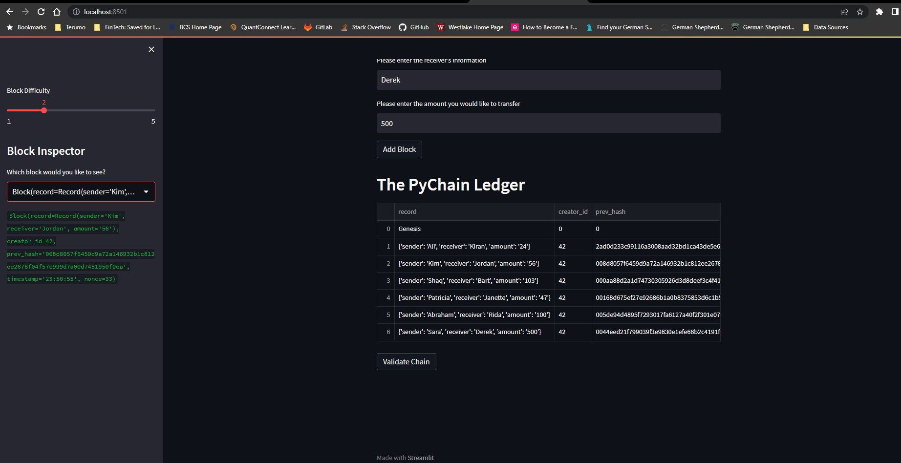
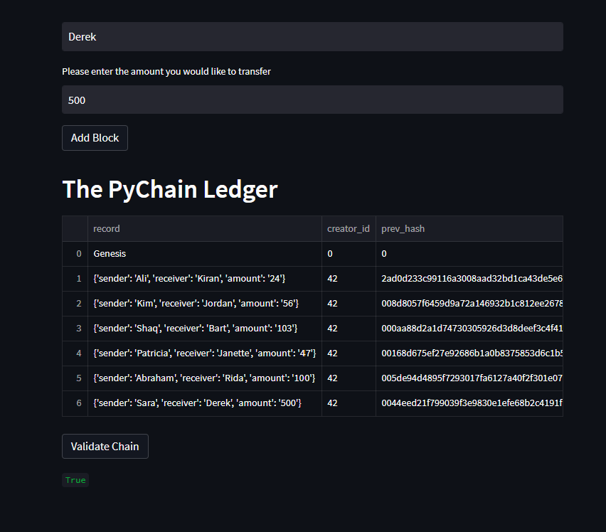

# Module_18_Challenge
Goal: To build a blockchain-based ledger with a user-friendly web interface. This ledger will allow the transfer of money between senders and receivers. The transactions will be recorded in hashed blocks, which can then be historically verified to maintain integrity. 

---

## Technologies 

This program uses the following programs:   
Python version 3.9.15   
Pandas version 1.5.2   
Streamlit version 1.16.0   

---

## Installation Guide

To check your current Python version, run the following code in your terminal:  
python --version  

To check if the aforementioned packages are installed on your local machine, use the following code:   
pip show pandas   
pip show streamlit  

If installation of these packages is required, run the following code:  
pip install pandas   
pip install streamlit  

---

## Usage

Important: This porgram is intended purely for academic purposes and is solely an example of what is possible.   

To begin using this program, please donwload the following files to your local machine:  
pychain.py  

Launch your terminal. Nagivate to the folder housing the 'pychain.py' file. In your terminal, type the following code:  
streamlit run pychain.py   

You should see the terminal connect to your local host and launch your web browser. Continue on to fill in input information and start creating your ledger!  

---

## Visual Examples

A blockchain containing hashed transactions: 

Proof of verified hash history:

---

## Contributors

Shahrukh Alam

---

## License

Columbia Engineering: FinTech Bootcamp
